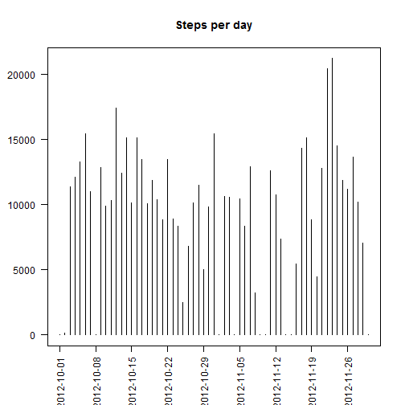
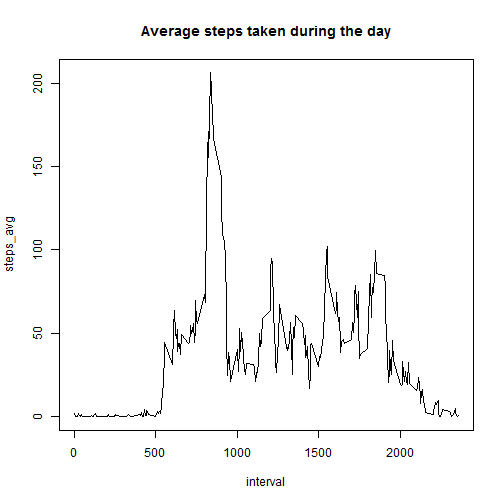
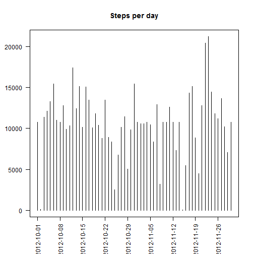
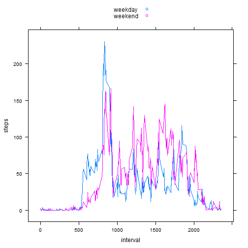

## Loading and preprocessing the data

Not much to say here...


```r
data <- read.csv("activity.csv", stringsAsFactors = F)
str(data)
```

```
## 'data.frame':	17568 obs. of  3 variables:
##  $ steps   : int  NA NA NA NA NA NA NA NA NA NA ...
##  $ date    : chr  "2012-10-01" "2012-10-01" "2012-10-01" "2012-10-01" ...
##  $ interval: int  0 5 10 15 20 25 30 35 40 45 ...
```

## What is mean total number of steps taken per day?

I'm going to use dplyr, lubridate and lattice libraries, so make sure you have them installed.


```r
library(dplyr)
library(lubridate)
library(lattice)
```

Let's draw histogram of steps per day. I changed some formating, just wanted to play with plot a little bit...  


```r
# histogram - steps per day
steps_per_day <- group_by(data, date = ymd(date)) %>%
        summarise(steps_total = sum(steps, na.rm = T)) %>%
        arrange(date)
plot(steps_per_day,
     type = "h",
     xaxt = "n",
     xlab = "",
     yaxt = "n",
     ylab = "",
     main = "Steps per day")
# format axis to look abit better than default
axis(2, las = 1)
axis.POSIXct(1,
            at = seq(steps_per_day$date[1],
                     steps_per_day$date[length(steps_per_day$date)],
                     by = "weeks"),
            format = "%Y-%m-%d",
            las = 2)
```

 

Now let's calculate mean and median total number of steps taken per day ignoring missing values.


```r
mean(steps_per_day$steps_total, na.rm = T)
```

```
## [1] 9354.23
```

```r
median(steps_per_day$steps_total, na.rm = T)
```

```
## [1] 10395
```

## What is the average daily activity pattern?

Here is graphical representation of daily activity pattern.


```r
steps_per_interval <- group_by(data, interval) %>%
        summarise(steps_avg = mean(steps, na.rm = T)) %>%
        arrange(interval)
plot(steps_per_interval, type = "l", main = "Average steps taken during the day")
```

 

If you would ask me which interval has most steps, I'd answer:  
"And the winner is ... interval **835** with **206.1698113** steps on average!!!"

Traditional way it would look like this. 5-minute interval containing the maximum number of steps is:


```r
steps_per_interval$interval[steps_per_interval$steps_avg == max(steps_per_interval$steps_avg)]
```

```
## [1] 835
```

## Imputing missing values

So first thing we do is calculate the total number of missing values. Like this


```r
sum(is.na(data$steps))
```

```
## [1] 2304
```

or like this


```r
sum(!complete.cases(data))
```

```
## [1] 2304
```

Fortunatelly in our case only 'steps' has missing values. So let's replace them with the average number steps for the same 5-minute interval, rounded to integer number:


```r
f_data <- data %>%
        group_by(interval) %>%
        mutate(steps = replace(steps,
                               is.na(steps),
                               round(mean(steps, na.rm = T))))
```

Now the same histogram as the first one, just based on corrected data.


```r
f_steps_per_day <- group_by(f_data, date = ymd(date)) %>%
        summarise(steps_total = sum(steps, na.rm = T)) %>%
        arrange(date)
plot(f_steps_per_day,
     type = "h",
     xaxt = "n",
     xlab = "",
     yaxt = "n",
     ylab = "",
     main = "Steps per day")
# format axis to look abit better than default
axis(2, las = 1)
axis.POSIXct(1,
            at = seq(f_steps_per_day$date[1],
                     f_steps_per_day$date[length(f_steps_per_day$date)],
                     by = "weeks"),
            format = "%Y-%m-%d",
            las = 2)
```

 

## Are there differences in activity patterns between weekdays and weekends?

Now let's add new factor column called day_type to our dataset. It will mark if the day is weekday or weekend.


```r
f_data <- f_data %>%
        mutate(day_type = as.factor(ifelse(wday(date) %in% c(1,7),
                                           "weekend",
                                           "weekday")))
```

If I would want to compare trends, I'd like to see this.


```r
f_steps <- f_data %>%
        mutate(day_type = as.factor(ifelse(wday(date) %in% c(1,7),
                                           "weekend",
                                           "weekday"))) %>%
        group_by(interval, day_type) %>%
        summarize(steps = mean(steps)) %>%
        arrange(interval)
xyplot(steps ~ interval, data = f_steps, type = "l", groups = day_type, auto.key = T)
```

 
